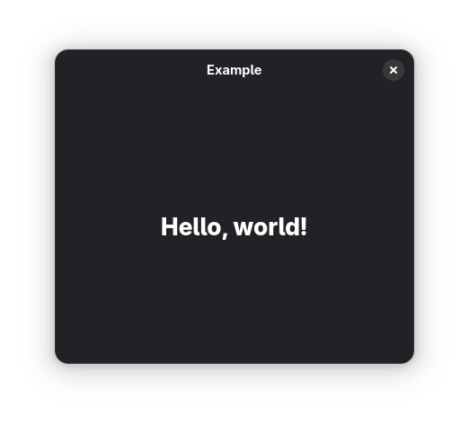

# ValaGtkTemplate
[](https://t.me/vala_lang)  

Simple template to build Gtk app with Vala & Blueprints



## Building
### Linux
1. Install required dependencies and compilers
```
gcc
vala
blueprint-compiler
gtk4
libadwaita
```
2. Build
```
meson setup --prefix=/usr build
ninja -C build
```
4. Install
```
ninja -C build install
```

### Windows
[Gist](https://gist.github.com/SpikedPaladin/f43c8f53080e4116082556d87f2279f4)